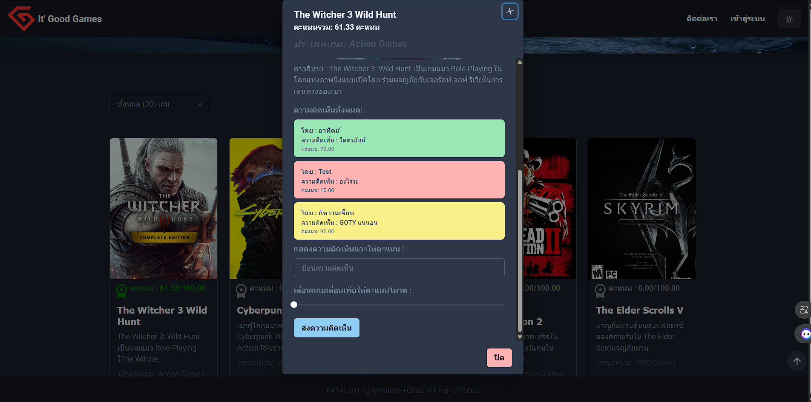

# React-Games-Project
## โปรเจคเว็บไซต์เกม : ให้ผู้ใช้เข้ามาโหวตและให้คะแนนเกมที่ชอบ
- 1.เตรียมนำ API ที่มีให้ไปใช้งานโดยเอาไป Deploy ผ่าน Web Server ตัวไหนก็ได้
- 2.ติดตั้ง Package และ Dependencies ด้วยคำสั่ง npm i , pnpm i 
- 3.ทดสอบโดยการรัน Project ด้วยคำสั่ง npm run dev , pnpm run dev 
สามารถนำไปประยุกต์ใช้งานต่างๆได้ 

### <ins> หน้าหลัก </ins> 

### <ins> กดเข้าไปแต่ละเกม </ins> 

### <ins> กดเข้าไปแต่ละเกม </ins> 

